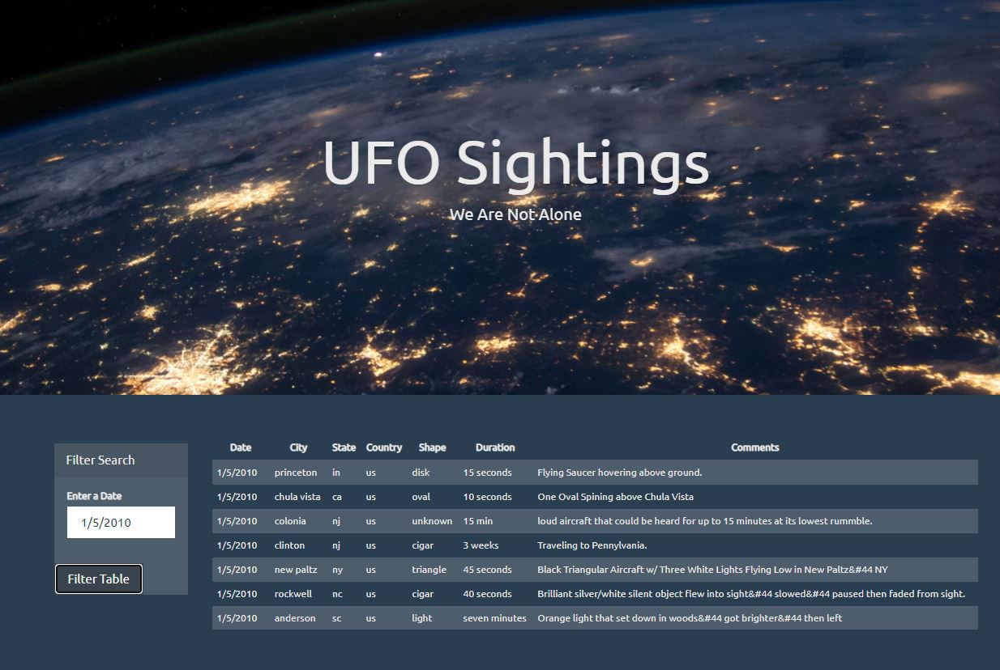

# javascript-challenge

Level 1: Automatic Table and Date Search 

. Created website using date form in HTML document
. Wrote JavaScript code that will listen for events and search through the date/time column to find rows that match user input.

